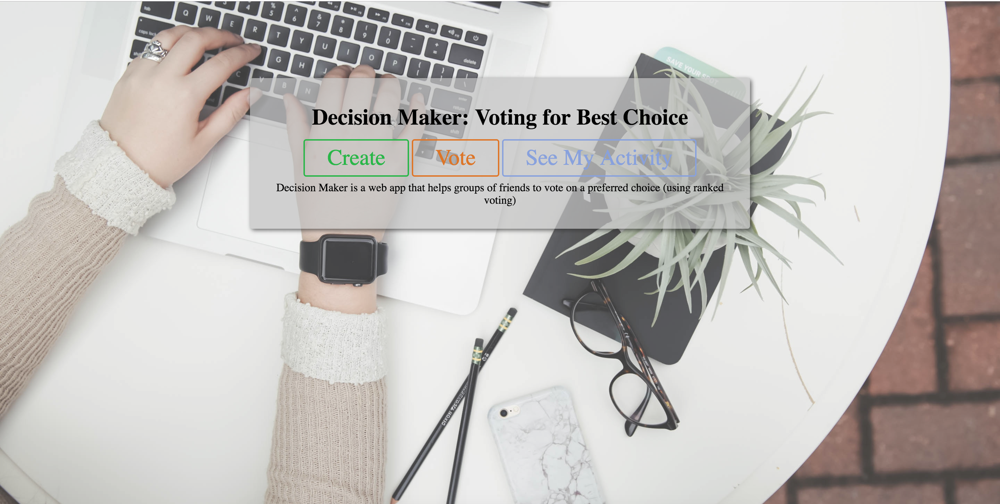
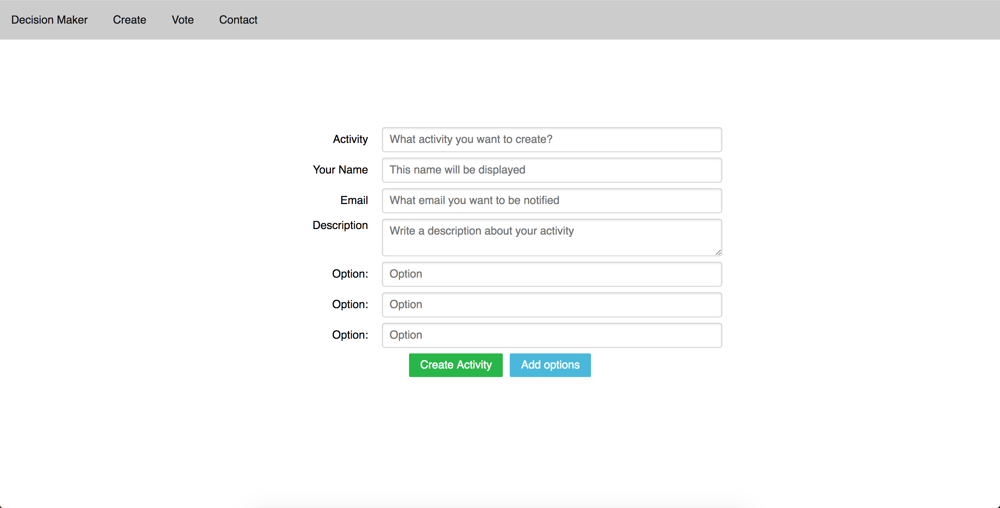
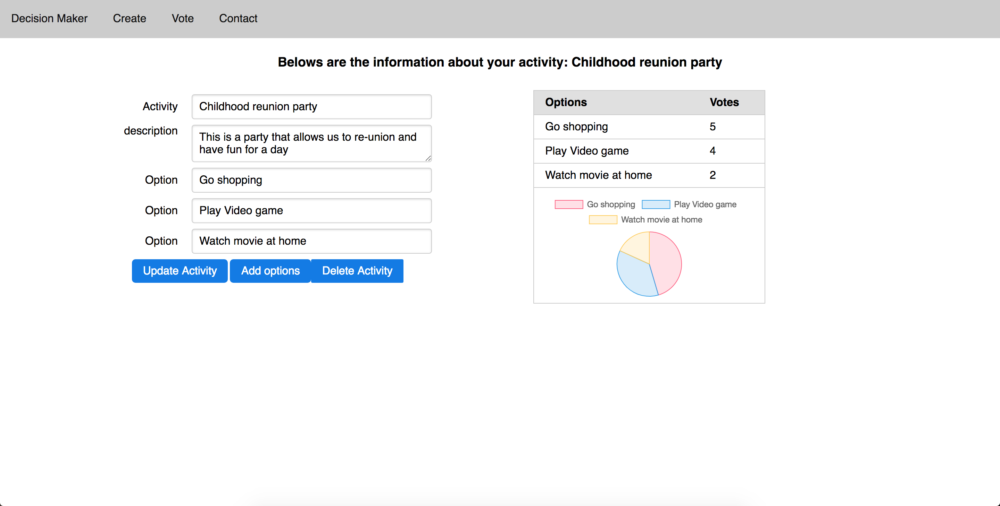
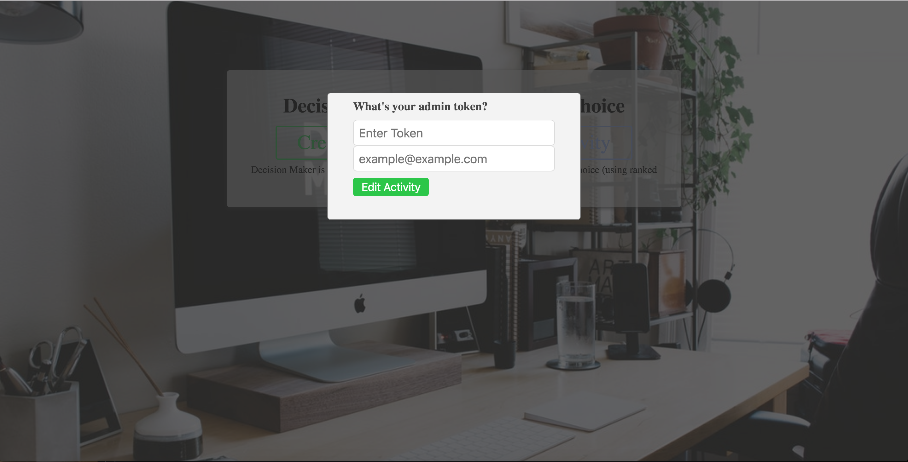
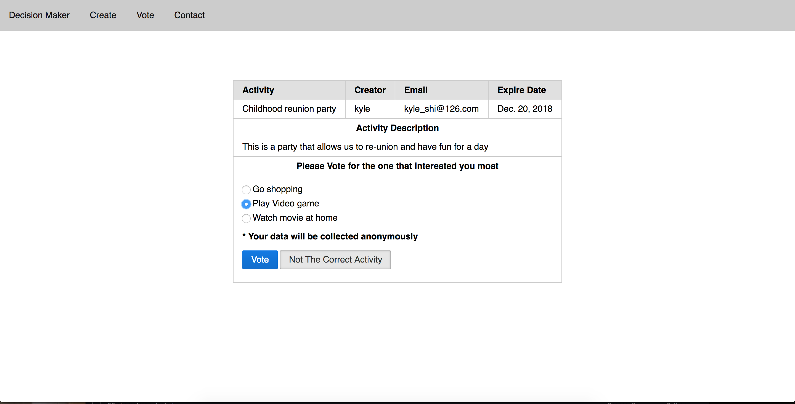
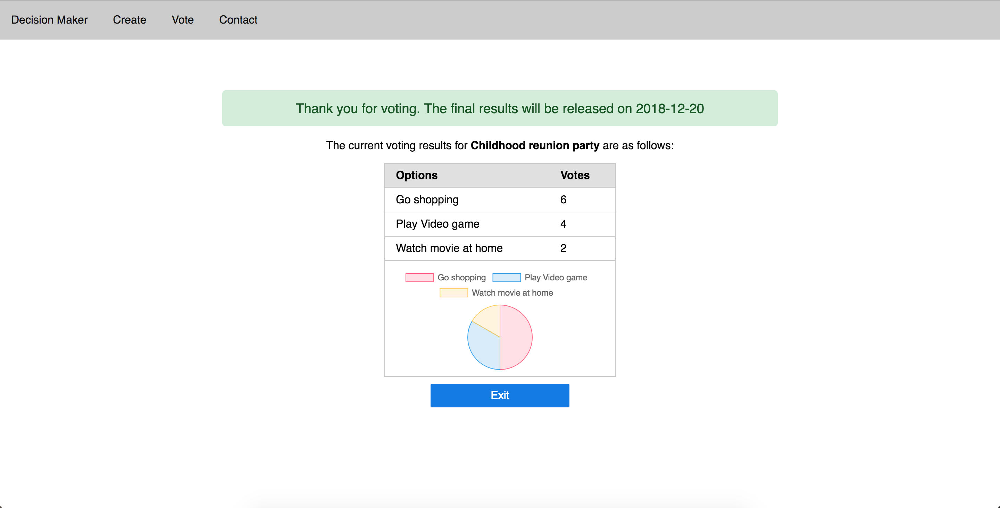
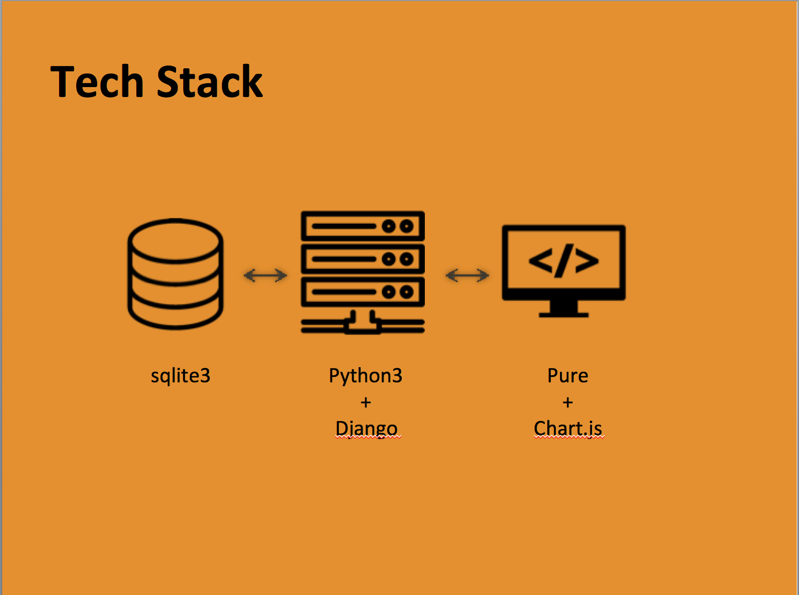

* Decision Maker
A Fullstack RESTFUL Web Application based on Django Framework. This application allows user to create an activity with multiple choices for voting. User is able to create, modify or delete his owned activity and invite their friends to vote for the best decision

** User Story
- a user can create a activity with multiple choices
- the creator must enter an email
- the poll creator is given two links: an administrative link (which - lets them access the results) and a submission link (which the user sends to their friends)
- a user receiving submission link is able to visit the voting page and vote for his choice
- the user can rank the choices (by drag and drop, or some other method) and then submits the poll
- the user is only able to see the current voting result once he has voted
- the creator is able to see the current voting result as a pie chart
- the user will not be able to vote after the poll expired

** Live Demo
1. On index page, user is directed with creating activity, voting for existing activity and manage his own page  

2. When creating an activity, creator is required to enter basic information, with 3 choice options. Creator can add more options if he needed  

3. On admin page, creator is able to see the current voting breakdown as pie chart. Creator also able to change information or choices.  

4. To vote, user is required to enter voting token. To access admin, creator is required to enter admin token as well as creator's email.  

5. User is able to vote for the choice he prefer. User can only see voting results after he voted
  

6. After voting, user is able to see the current voting results  

** Tech Stack
This application use Python3 Django framework as back-end. Database is sqlite3, however, Django is compatible with multiple different database therefore switching to other SQL database is very simple. On frontend, this application use chart.js to genereate pie chart and yahoo pure css framework  

